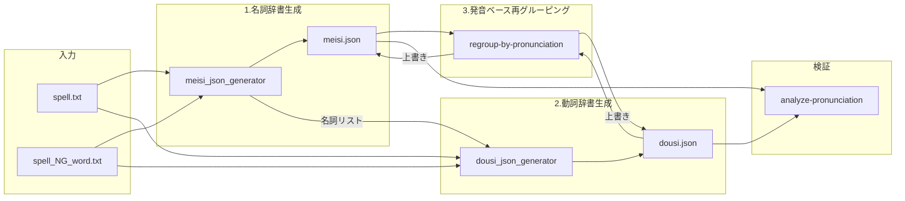
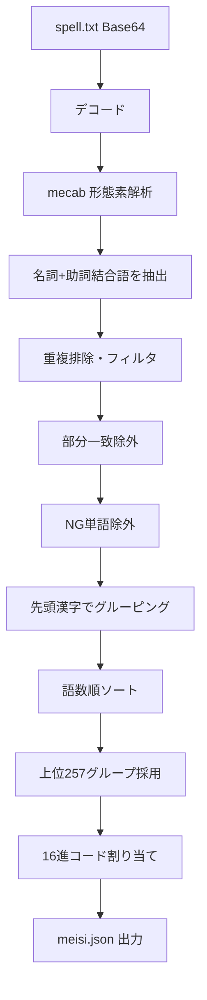
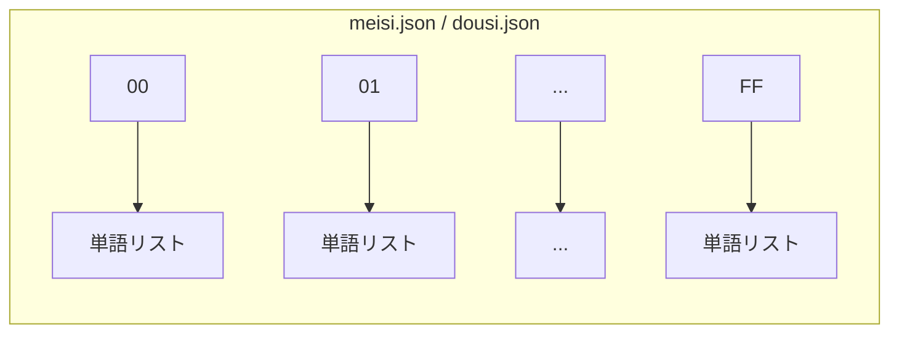
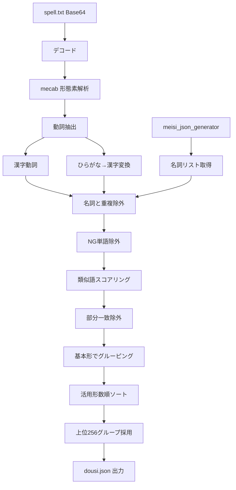
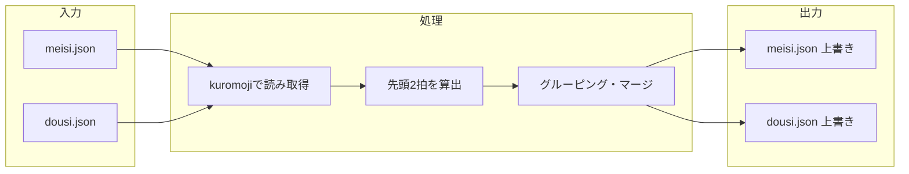
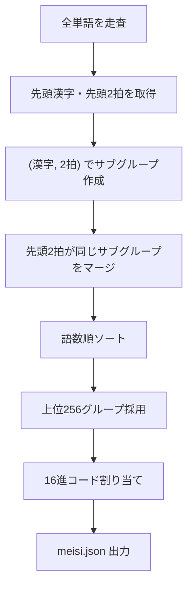
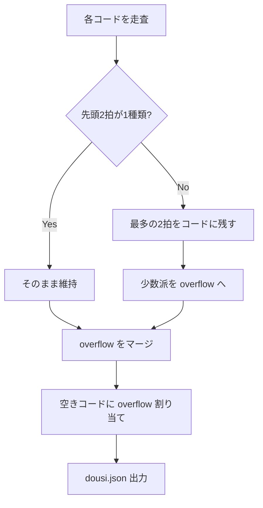
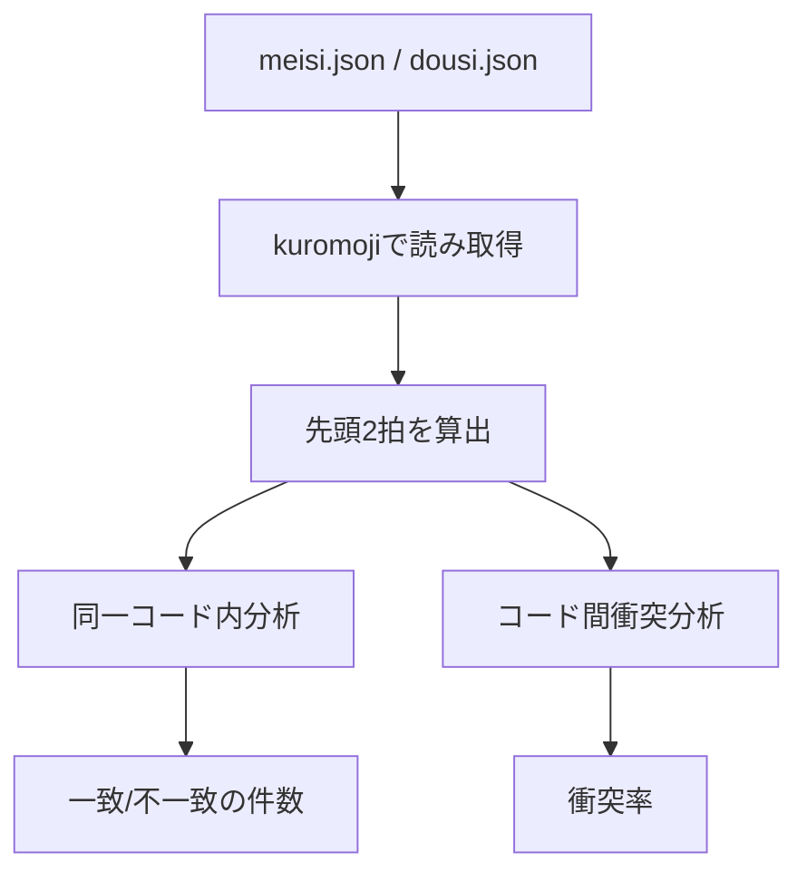
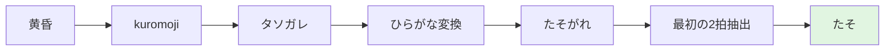
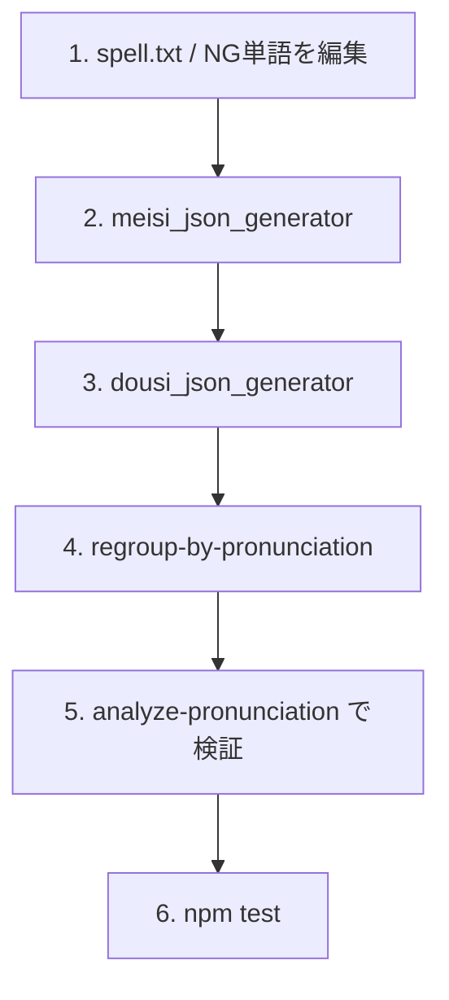

# 辞書生成ロジック

yukichant の `meisi.json`（名詞辞書）と `dousi.json`（動詞辞書）の生成・再グルーピングのロジックをまとめたドキュメントです。

## 概要

辞書生成は以下の3段階で行われます。

1. **名詞辞書の初回生成** (`raw_data/meisi_json_generator.js`)
2. **動詞辞書の初回生成** (`raw_data/dousi_json_generator.js`)
3. **発音ベースの再グルーピング** (`regroup-by-pronunciation.js`)

発音の妥当性を検証するための **発音分析スクリプト** (`analyze-pronunciation.js`) も用意されています。



### 名詞と動詞の違い

| 項目 | 名詞 (meisi) | 動詞 (dousi) |
|------|-------------|--------------|
| **形態素** | 名詞（+連体化助詞結合語） | 動詞 |
| **初回グルーピング基準** | 先頭の漢字 | 基本形 |
| **形態素解析** | mecab のみ | mecab + kuromoji（IPAdic） |
| **他辞書との関係** | 名詞リストを標準出力（動詞生成で除外に使用） | 名詞リストと重複する語を除外 |
| **16進コード順序** | 0A, E3, 81-83 優先 → 20~FF → 00~1F, DF | 20~FF → 00~1F |
| **再グルーピング方針** | 先頭2拍が同じサブグループをマージ | 最多の2拍をコードに残し、少数派は overflow に再配置 |
| **同一コード内の先頭2拍** | 全コードで一致 | 全コードで一致 |
| **コード間の先頭2拍衝突** | 0% | 同音異義動詞により一部残存 |

---

## 1. 名詞辞書の初回生成 (meisi_json_generator.js)

### 入力

- `raw_data/spell.txt` … Base64エンコードされた呪文テキスト
- `raw_data/spell_NG_word.txt` … 除外する単語リスト（1行1語、`#`で始まる行はコメント）

### 処理フロー

```
spell.txt (Base64)
  → デコード
  → mecab で形態素解析
  → 名詞（+助詞結合語）を抽出
  → 重複排除・フィルタリング
  → 部分一致除外
  → NG単語除外
  → 先頭漢字でグルーピング
  → 16進コードに割り当て
  → data/meisi.json 出力
```



### 詳細

#### 名詞抽出 (extractNouns)

mecab の形態素解析結果から、名詞および「名詞+連体化助詞」の結合語を抽出します。

- 名詞が来たら蓄積を開始
- 連体化助詞（「の」など）が続いた場合は結合
- 連体化助詞の直後に名詞以外が来たらリセット

#### フィルタリング

- **重複排除**: `sort -u` 相当でユニーク化
- **長さ・漢字**: 2文字以上かつ漢字を含む語のみ
- **部分一致除外**: 他の語の部分文字列になっている語を除外
- **NG単語除外**: `spell_NG_word.txt` に含まれる語を除外

#### グルーピング (groupByFirstKanji)

- 各語の**先頭の漢字**でグルーピング
- 語数が多いグループを上位にソート
- 上位257グループを採用（実際は256コードに割り当て）

#### 16進コードの割り当て順序 (generateMeisiHexOrder)

```
優先: 0A, E3, 81, 82, 83
中間: 20~FF（81, 82, 83, DF, E3 を除く）
末尾: 00~1F（0A を除く）, DF
```

### 出力

- `data/meisi.json` … `{ "00": ["単語1", "単語2", ...], ... }` 形式
- 標準出力 … 名詞リスト（dousi_json_generator.js が参照）



---

## 2. 動詞辞書の初回生成 (dousi_json_generator.js)

### 入力

- `raw_data/spell.txt` … 同上
- `raw_data/spell_NG_word.txt` … 同上
- `raw_data/meisi_json_generator.js` の標準出力 … 名詞リスト（動詞候補から除外するため）

### 処理フロー

```
meisi_json_generator 実行 → 名詞リスト取得
spell.txt (Base64)
  → デコード
  → mecab で形態素解析
  → 動詞を抽出（漢字動詞 + ひらがな動詞の漢字変換）
  → 名詞リストと重複する語を除外
  → NG単語除外
  → 類似語スコアリング
  → 部分一致除外
  → 基本形でグルーピング
  → 16進コードに割り当て
  → data/dousi.json 出力
```



### 詳細

#### 動詞抽出 (extractVerbs)

- **漢字動詞**: 形態素解析で動詞と判定された漢字表記の語をそのまま採用
- **ひらがな動詞**: 基本形が3文字以上のものについて、IPAdic 辞書で読み→漢字の逆引きを試行。mecab で同じ読みの動詞として認識される場合のみ採用

#### スコアリング・フィルタリング (scoreFilterAndGroup)

- **類似語スコア**: 各動詞について、基本形リスト内で編集距離（Levenshtein）1以内のマッチ数をカウント。スコアが高い順にソート
- **部分一致除外**: 他の語の部分文字列になっている語を除外
- **基本形でグルーピング**: 同じ基本形の活用形を1グループにまとめる
- **活用形数でソート**: 活用形が多い基本形を優先して256グループを選出

#### 16進コードの割り当て順序 (generateHexOrder)

```
20~FF → 00~1F の順
```

---

## 3. 発音ベースの再グルーピング (regroup-by-pronunciation.js)

初回生成された辞書を、**読みの先頭2拍**を基準に再グルーピングします。文章（視覚）だけでなく音声でも区別しやすくするためです。

### 前提

- kuromoji（yukidic 辞書）で各単語の読み（カタカナ）を取得
- **先頭2拍（モーラ）**: 拗音（ゃゅょ等）・促音（っ）は1拍として扱う



### 名詞の再グルーピング (regroupMeisi)

#### 制約

- 同じ先頭漢字 × 同じ先頭2拍の単語は必ず同じコードに入る
- 先頭漢字が同じでも読みの先頭2拍が異なれば別コードに分割してよい
- 異なるコード間で先頭2拍が衝突しないようにする

#### アルゴリズム

1. 各単語の先頭漢字と先頭2拍を kuromoji で取得
2. `(先頭漢字, 先頭2拍)` でサブグループを作成
3. 先頭2拍が同じサブグループ同士をマージ（語数を増やすため）
4. 語数順にソートして上位256グループを採用
5. 16進コードに割り当てて出力



#### 結果

- 同一コード内の先頭2拍不一致: 0
- コード間の先頭2拍衝突率: 0%

### 動詞の再グルーピング (regroupDousi)

#### 制約

- 動詞は活用形で先頭2拍の末尾が変わる（散る/散れ/散らす）のが自然
- 同一コード内の先頭2拍不一致を分割しつつ、256キーを維持
#### アルゴリズム

1. 各コードの単語を先頭2拍でサブグループに分割
2. 最多の先頭2拍を持つサブグループをそのコードに残す
3. 少数派のサブグループは overflow リストに入れる
4. overflow 内で先頭2拍が同じグループ同士をマージ
5. 空きコードに overflow を割り当て



#### 結果

- 同一コード内の先頭2拍不一致: 0
- コード間の先頭2拍衝突: 同音異義の動詞（掛ける/懸ける/賭ける等）により一部残存

### 実行方法

```bash
node regroup-by-pronunciation.js
```

`data/meisi.json` と `data/dousi.json` が上書きされます。

---

## 4. 発音分析 (analyze-pronunciation.js)

辞書の音声区別性を検証するスクリプトです。



### 分析内容

1. **同一コード内の分析**: 同じ16進コードに割り当てられた単語同士で、最初の2拍が一致しているか
2. **コード間の衝突分析**: 異なる16進コードの単語で、最初の2拍が同じものがあるか（衝突率）

### 実行方法

```bash
node analyze-pronunciation.js
```

### 出力例

```
=== meisi.json の発音分析 ===

[meisi] 同一コード内の分析結果:
  最初の2拍が一致: 161 コード
  最初の2拍が不一致: 0 コード

=== 異なるコード間での最初の2拍の衝突分析 ===

[meisi] 異なるコード間の最初の2拍衝突:
  衝突している最初の2拍の種類: 0
  衝突率: 0.0%
```

---

## 補足: 先頭2拍の算出

```javascript
// カタカナ → ひらがな変換
function katakanaToHiragana(str) {
  return str.replace(/[\u30A1-\u30F6]/g, ch =>
    String.fromCharCode(ch.charCodeAt(0) - 0x60)
  );
}

// 読みから最初の2拍を取得
// 拗音（ぁぃぅぇぉゃゅょゎ）・促音（っ）は直前の文字と合わせて1拍
function getFirst2Morae(reading) {
  const hira = katakanaToHiragana(reading);
  const morae = [];
  const smallKana = 'ぁぃぅぇぉゃゅょゎっ';
  for (let i = 0; i < hira.length && morae.length < 2; i++) {
    let mora = hira[i];
    if (i + 1 < hira.length && smallKana.includes(hira[i + 1])) {
      mora += hira[i + 1];
      i++;
    }
    morae.push(mora);
  }
  return morae.join('');
}
```

例: 「黄昏」→ タソガレ → 最初の2拍は「たそ」



```mermaid
flowchart TD
    subgraph 拗音・促音の扱い
        A["きゃ → 1拍"]
        B["きょ → 1拍"]
        C["っ → 直前と合わせて1拍"]
    end

    subgraph 例
        D["流星 リュウセイ → りゅう"]
        E["活殺 カッサツ → かっさ"]
    end
```

---

## 辞書更新の手順



1. `raw_data/spell.txt` や `spell_NG_word.txt` を編集（必要な場合）
2. 名詞辞書を再生成: `node raw_data/meisi_json_generator.js`（出力は dousi 生成で使用）
3. 動詞辞書を再生成: `node raw_data/dousi_json_generator.js`
4. 発音ベースで再グルーピング: `node regroup-by-pronunciation.js`
5. 検証: `node analyze-pronunciation.js`
6. テスト: `npm test`
