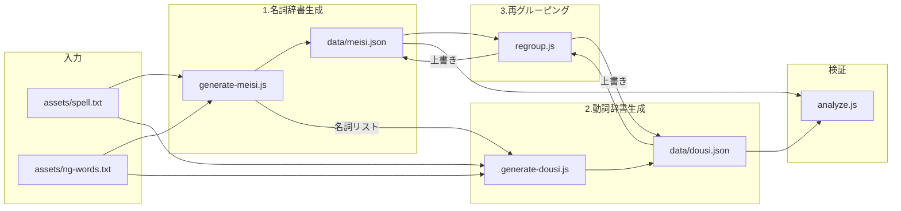
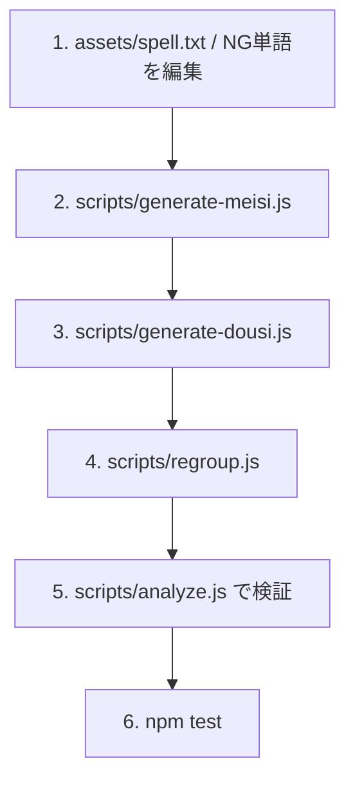
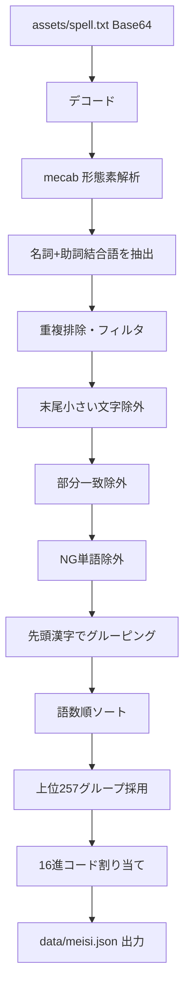
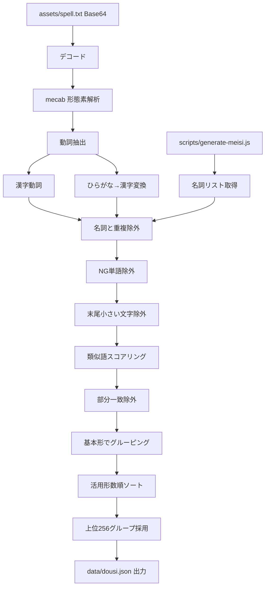
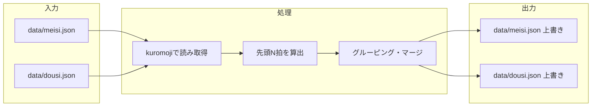
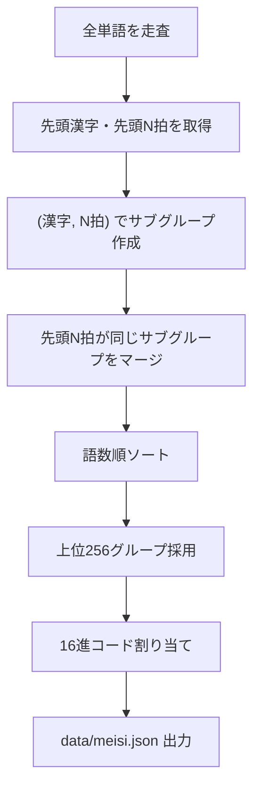
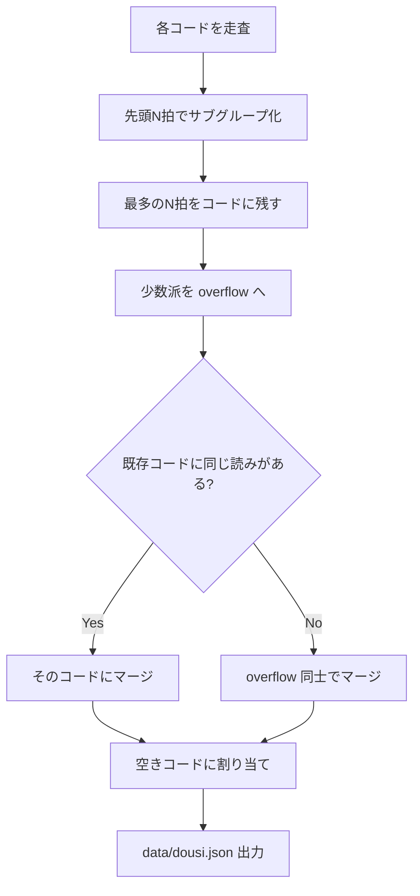
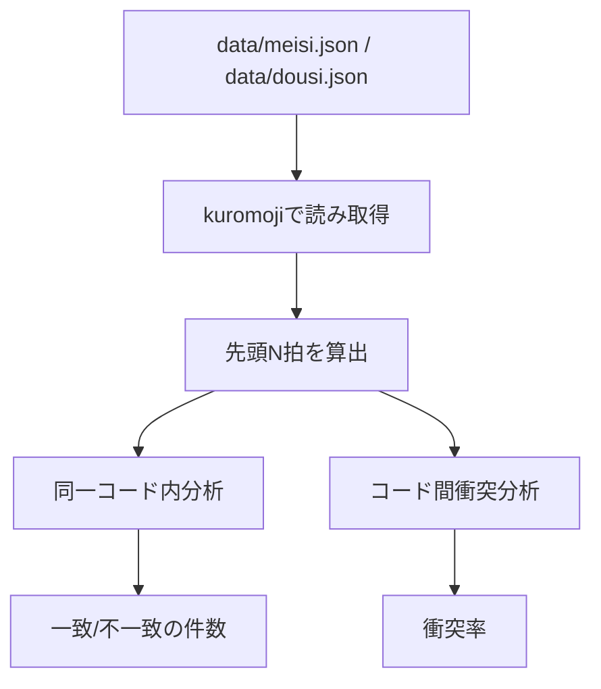
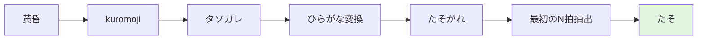
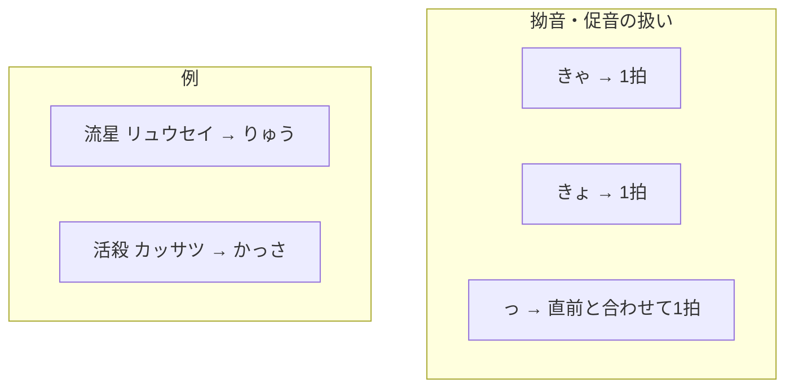

# 辞書生成ロジック

yukichant の `meisi.json`（名詞辞書）と `dousi.json`（動詞辞書）の生成・再グルーピングのロジックをまとめたドキュメントです。

## 概要

yukichant はテキストを呪文に変換する際、各バイト（00〜FF）を名詞・動詞に対応付けます。この対応表が `data/meisi.json` と `data/dousi.json` です。

辞書生成では、元テキストから単語を抽出し、**発音（先頭N拍）が同じ単語を同じコードにまとめる**ことで、音声で聞いても区別しやすい呪文を実現しています。

## 全体フロー

辞書生成は以下の3段階＋検証で行われます。

| ステップ | スクリプト | 入力 | 出力 |
| :--- | :--- | :--- | :--- |
| 1. 名詞辞書の初回生成 | `scripts/generate-meisi.js` | `assets/spell.txt`, `assets/ng-words.txt` | `data/meisi.json` + 名詞リスト（標準出力） |
| 2. 動詞辞書の初回生成 | `scripts/generate-dousi.js` | 同上 + 名詞リスト | `data/dousi.json` |
| 3. 発音ベースの再グルーピング | `scripts/regroup.js` | `data/meisi.json`, `data/dousi.json` | 両ファイルを上書き |
| 検証 | `scripts/analyze.js` | `data/meisi.json`, `data/dousi.json` | 発音衝突率レポート |



### 名詞と動詞の違い（早見表）

| 項目 | 名詞 (meisi) | 動詞 (dousi) |
|------|-------------|--------------|
| **形態素** | 名詞（+連体化助詞結合語） | 動詞 |
| **初回グルーピング基準** | 先頭の漢字 | 基本形 |
| **形態素解析** | mecab のみ | mecab + kuromoji（IPAdic） |
| **他辞書との関係** | 名詞リストを標準出力（動詞生成で除外に使用） | 名詞リストと重複する語を除外 |
| **再グルーピング方針** | 先頭2拍が同じサブグループをマージ | 先頭3拍で分割し、読みが完全一致する語をマージ |
| **同一コード内の発音一致** | 先頭2拍で一致 | 先頭3拍で一致 |
| **コード間の発音衝突** | 0% (先頭2拍) | 0% (先頭3拍) |

### 辞書の JSON 構造

各辞書は 256 エントリ（00〜FF）を持ち、以下の形式です。

```json
{
  "00": {
    "firstKanji": ["単", "語"],
    "mora": "たんご",
    "words": ["単語1", "単語2"],
    "readings": ["タンゴ1", "タンゴ2"]
  }
}
```

- `firstKanji`: グループに含まれる単語の先頭漢字のリスト
- `mora`: グループで一致している先頭の拍（名詞は2拍、動詞は3拍）
- `words`: そのコードに対応する単語（サーフェス）のリスト
- `readings`: 各単語のフル読みのリスト

## 辞書更新の手順

辞書を更新する場合は、以下の手順で実行します。



```bash
# 一括実行（推奨）
npm run json-generate

# 個別実行する場合
npm run json-generate:meisi   # 1-2. 名詞辞書を再生成（出力は dousi 生成で使用）
npm run json-generate:dousi   # 3. 動詞辞書を再生成
npm run json-regroup          # 4. 発音ベースで再グルーピング
npm run json-analyze          # 5. 検証
npm test                      # 6. テスト
```

---

## 各工程の詳細

ここからは、各ステップの内部ロジックを詳しく説明します。

### 1. 名詞辞書の初回生成 (scripts/generate-meisi.js)

#### 入力

- `assets/spell.txt` … Base64エンコードされた呪文テキスト
- `assets/ng-words.txt` … 除外する単語リスト（1行1語、`#`で始まる行はコメント）

#### 処理フロー



#### 名詞抽出 (extractNouns)

mecab の形態素解析結果から、名詞および「名詞+連体化助詞」の結合語を抽出します。

- 名詞が来たら蓄積を開始
- 連体化助詞（「の」など）が続いた場合は結合
- 連体化助詞の直後に名詞以外が来たらリセット

#### フィルタリング

- **重複排除**: `sort -u` 相当でユニーク化
- **長さ・漢字**: 2文字以上かつ漢字を含む語のみ
- **末尾の小さい文字除外**: 末尾が小さい文字（ぁぃぅぇぉゃゅょゎっ）で終わる語を除外（`helpers.js` の `removeSmallKanaEnd` を使用）
- **部分一致除外**: 他の語の部分文字列になっている語を除外
- **NG単語除外**: `assets/ng-words.txt` に含まれる語を除外

#### グルーピング (groupByFirstKanji)

- 各語の**先頭の漢字**でグルーピング
- 語数が多いグループを上位にソート
- 上位257グループを採用（実際は256コードに割り当て）

#### 16進コードの割り当て順序 (generateMeisiHexOrder)

00からFFまでを順番に生成します。特定の単語のコード固定は、再グルーピング時のスワップ処理で担保します。

```javascript
function generateMeisiHexOrder() {
  const order = [];
  for (let i = 0; i <= 255; i++) {
    order.push(i.toString(16).toUpperCase().padStart(2, '0'));
  }
  return order;
}
```

#### 出力

- `data/meisi.json` … `{ "00": { "firstKanji": [...], "mora": "...", "words": [...], "readings": [...] }, ... }` 形式
- 標準出力 … 名詞リスト（scripts/generate-dousi.js が参照）

---

### 2. 動詞辞書の初回生成 (scripts/generate-dousi.js)

#### 入力

- `assets/spell.txt` … 同上
- `assets/ng-words.txt` … 同上
- `scripts/generate-meisi.js` の標準出力 … 名詞リスト（動詞候補から除外するため）

#### 処理フロー



#### 動詞抽出 (extractVerbs)

- **漢字動詞**: 形態素解析で動詞と判定された漢字表記の語をそのまま採用
- **ひらがな動詞**: 基本形が3文字以上のものについて、IPAdic 辞書で読み→漢字の逆引きを試行。mecab で同じ読みの動詞として認識される場合のみ採用

#### スコアリング・フィルタリング (scoreFilterAndGroup)

- **類似語スコア**: 各動詞について、基本形リスト内で編集距離（Levenshtein）1以内のマッチ数をカウント。スコアが高い順にソート
- **末尾の小さい文字除外**: 末尾が小さい文字（ぁぃぅぇぉゃゅょゎっ）で終わる語を除外（`helpers.js` の `removeSmallKanaEnd` を使用）
- **部分一致除外**: 他の語の部分文字列になっている語を除外
- **基本形でグルーピング**: 同じ基本形の活用形を1グループにまとめる
- **活用形数でソート**: 活用形が多い基本形を優先して256グループを選出

#### 16進コードの割り当て順序 (generateDousiHexOrder)

名詞と同様に、00からFFまでを順番に生成します。

---

### 3. 発音ベースの再グルーピング (scripts/regroup.js)

初回生成された辞書を、**読みの先頭N拍**を基準に再グルーピングします。文章（視覚）だけでなく音声でも区別しやすくするためです。

#### 前提

- kuromoji（yukidic 辞書）で各単語の読み（カタカナ）を取得
- **先頭N拍（モーラ）**: 拗音（ゃゅょ等）・促音（っ）は1拍として扱う



#### 名詞の再グルーピング (regroupMeisi)

**制約:**

- 同じ先頭漢字 × 同じ先頭N拍の単語は必ず同じコードに入る
- 先頭漢字が同じでも読みの先頭N拍が異なる場合はサブグループに分割する
- 異なるコード間で先頭N拍が衝突しないようにする

**アルゴリズム:**

1. 各単語の先頭漢字と先頭N拍を kuromoji で取得
2. `(先頭漢字, 先頭N拍)` でサブグループを作成
3. 先頭N拍が同じサブグループ同士をマージ（語数を増やすため）
4. 語数順にソートして上位256グループを採用
5. 16進コードに割り当てて出力



**結果:**

- 同一コード内の先頭2拍不一致: 0
- コード間の先頭2拍衝突率: 0%

#### 動詞の再グルーピング (regroupDousi)

**制約:**

- 動詞は活用形で先頭N拍の末尾が変わる（散る/散れ/散らす）のが自然
- 同一コード内の先頭N拍不一致を分割しつつ、256キーを維持
- **読み（先頭N拍）が完全に一致する同音異義語は、同じコードに集約する**

**アルゴリズム:**

1. 各コードの単語を先頭N拍でサブグループに分割
2. 最多の先頭N拍を持つサブグループをそのコードに残す
3. 少数派のサブグループは overflow リストに入れる
4. **既存のコードまたは他の overflow グループと先頭N拍が一致する場合、そのコードにマージする**
5. それでも空いているコードに、残りの overflow を割り当て



**結果:**

- 同一コード内の先頭3拍不一致: 0
- コード間の先頭3拍衝突率: 0%（同音異義語がすべて同じコードに集約されたため）

#### 名詞と動詞の拍数設定

名詞と動詞で異なる拍数設定を採用しています。

- **名詞**: **先頭2拍**を維持。名詞は語彙数が多く、3拍にするとグループが細分化されすぎて割り当て外が大量に発生するため、2拍での衝突率0%を優先しています。
- **動詞**: **先頭3拍**を採用。動詞は同音異義語（カケル、シメル等）による衝突を解消するため、3拍かつ「読みが一致する単語を同じコードにまとめる」ロジックを導入しました。

以前は2拍でグルーピングしていましたが、同音異義語が別々のコードに分散して衝突が発生していました。動詞に **3拍**（`MORAE_COUNT = 3`）を採用し、かつ **「読みが一致する単語は同じコードにまとめる」** ロジックを導入したことで、音声デコード時の曖昧さが解消されました。

- **3拍マージの結果**: 256キーの中に主要な動詞を収容しつつ、コード間の発音衝突を 0% にすることができました。
- **実装**: `scripts/regroup.js` および `scripts/analyze.js` 内で、対象（meisi/dousi）に応じて拍数を使い分けています。

#### v3.0.5 互換性維持のためのスワップ処理

再グルーピングの最後に、特定の単語が v3.0.5 と同じ 16進数コードに割り当てられるようスワップを行います。これは `echo 'echo unko' | chant` のような特定の入力に対する呪文の生成結果（v3.0.5 時点の動作）を保証するために導入されました。

**v3.0.5 と現在の出力比較（参考）:**

`echo 'echo unko' | chant` を実行した際の出力例です。

| バージョン | 出力される呪文 |
| :--- | :--- |
| **v3.0.5 (参考)** | `誘いより邪を魂すら借り。業を羅刹に星より失え。血よ果たせ。` |
| **現在 (参考)** | `誘いより邪を魂よ借り。強欲の羅刹に星と失え。息吹よ守る。` |

※ 現在の出力において、前半の「誘いより邪を魂すら借り。」が維持されているのは、スワップ処理によるものです。後半の「血よ果たせ。」に相当する部分は、辞書から単語が削除されたため、現在の辞書で同じコードに割り当てられている別の単語に置き換わっています。

**v3.0.5 と現在の単語・コード対応表:**

| 呪文の断片 | 辞書種別 | v3.0.5 のコード | 現在の単語（スワップ前） | 状態 |
| :--- | :--- | :---: | :--- | :--- |
| **誘いより** | 名詞 (meisi) | `9E` | 希望の | ✅ スワップ維持 |
| **邪を** | 名詞 (meisi) | `5C` | 邪悪を | ✅ スワップ維持 |
| **魂すら** | 名詞 (meisi) | `45` | 裁きを | ✅ スワップ維持 |
| **借り** | 動詞 (dousi) | `CD` | 絡める | ✅ スワップ維持 |
| **業を** | 名詞 (meisi) | `47` | 祈り | ✅ スワップ維持 |
| **羅刹に** | 名詞 (meisi) | `9B` | 幻を | ✅ スワップ維持 |
| **星より** | 名詞 (meisi) | `3F` | 底を | ✅ スワップ維持 |
| **失え** | 動詞 (dousi) | `C9` | 五つの | ✅ スワップ維持 |
| **血よ** | 名詞 (meisi) | `36` | 息吹を | ❌ 辞書から削除 |
| **果たせ** | 動詞 (dousi) | `38` | 守る | ❌ 辞書から削除 |

※ 「現在の単語（スワップ前）」は、自動グルーピングロジックによって本来そのコードに割り当てられていた単語です。スワップ処理により、これらと入れ替わる形で v3.0.5 相当の単語が指定のコードに配置されます。

---

### 4. 発音分析 (scripts/analyze.js)

辞書の音声区別性を検証するスクリプトです。



#### 分析内容

1. **同一コード内の分析**: 同じ16進コードに割り当てられた単語同士で、最初のN拍が一致しているか
2. **コード間の衝突分析**: 異なる16進コードの単語で、最初のN拍が同じものがあるか（衝突率）

#### 実行方法

```bash
npm run json-analyze
```

#### 出力例

```
=== meisi.json の発音分析（先頭2拍） ===

[meisi] 同一コード内の分析結果:
  最初の2拍が一致: 161 コード
  最初の2拍が不一致: 0 コード

=== 異なるコード間での発音の衝突分析 ===

[meisi] 異なるコード間の最初の2拍衝突:
  衝突している最初の2拍の種類: 0
  衝突率: 0.0%
```

---

## 補足: 先頭N拍（モーラ）の算出

再グルーピングと発音分析で使用される、先頭N拍の算出ロジックです。

```javascript
// カタカナ → ひらがな変換
function katakanaToHiragana(str) {
  return str.replace(/[\u30A1-\u30F6]/g, ch =>
    String.fromCharCode(ch.charCodeAt(0) - 0x60)
  );
}

// 読みから最初のN拍を取得
// 拗音（ぁぃぅぇぉゃゅょゎ）・促音（っ）は直前の文字と合わせて1拍
function getFirstNMorae(reading, n) {
  const hira = katakanaToHiragana(reading);
  const morae = [];
  const smallKana = 'ぁぃぅぇぉゃゅょゎっ';
  for (let i = 0; i < hira.length && morae.length < n; i++) {
    let mora = hira[i];
    if (i + 1 < hira.length && smallKana.includes(hira[i + 1])) {
      mora += hira[i + 1];
      i++;
    }
    morae.push(mora);
  }
  return morae.join('');
}
```

例: 「黄昏」→ タソガレ → 最初の2拍は「たそ」




