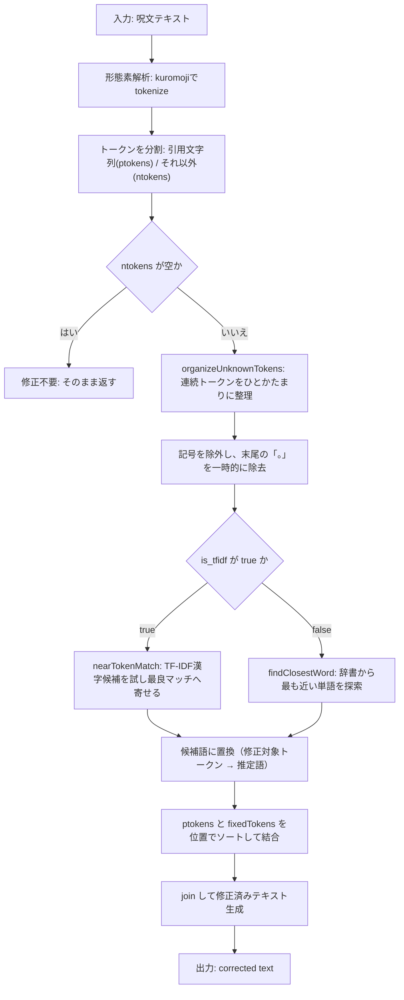
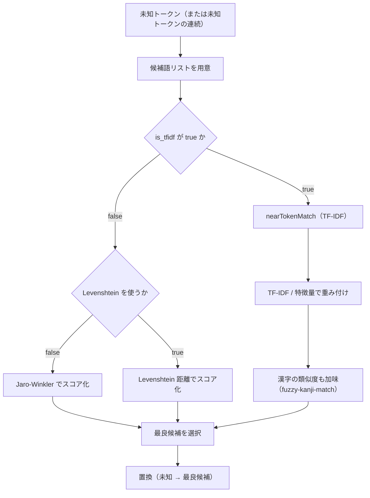
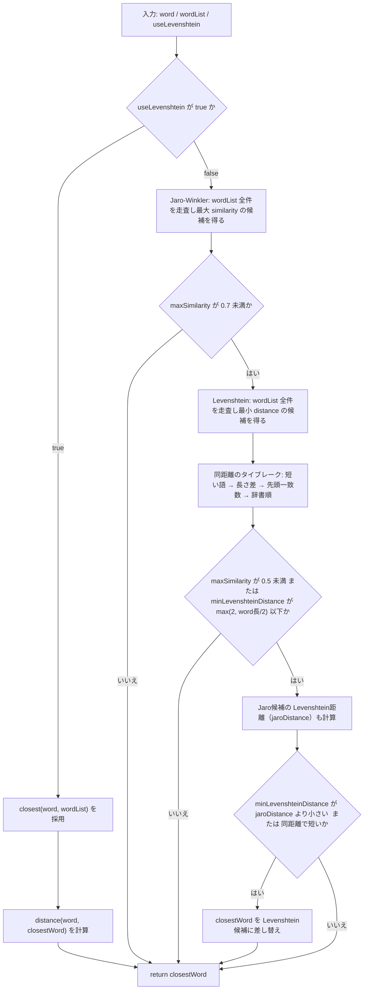

# 誤字修正アルゴリズム（typo-correction）概要

このドキュメントは、`src/typo-correction.js` の誤字修正処理（`exec()` を中心）を、Mermaid図で俯瞰できるようにまとめたものです。

## 全体像（`exec()` の流れ）

## 未知トークンの補正ロジック（距離系 / TF-IDF系）

## `findClosestWord()` の内部ロジック

## 分岐に関わる主なオプション（要点）

- **`-s`**: デコード時に **誤字修正を行わない**（入力をそのまま解釈する、strict decode mode）
- **`--levenshtein`**: 距離計算を **Levenshtein** に切り替え（デフォルトは **Jaro-Winkler**）
- **`--no-tfidf` / `is_tfidf=false`**: TF-IDFベースの探索（`nearTokenMatch()`）を使わない
- **`-v / -vv`**: デバッグ出力（修正前後・スコア等の詳細が増える）

